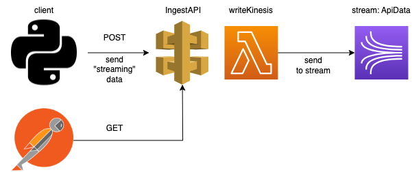

# AWS E-commerce Streaming

This project aims at simulating the cloud-based infrastructure of an e-commerce company. 

## Goals

Main goal :
- Process transactions made by customers
- Give customers access to their purchase history

Secondary goals :
- Compute average sales
- Other analytics stats

## Content

- [Dataset](##Dataset)
- [Pipelines](##Pipelines)
  - [Ingestion](###Ingestion)
  - [Stream to S3](###Stream to S3)
  - [Stream to DynamoDB](###Stream to DynamoDB)

## Dataset

The dataset constisting of 8 columns and 541 909 rows, represents transactions made on the e-commerce website.

Attributes : InvoiceNo, StockCode, Description, Quantity, InvoiceDate, UnitPrice, CustomerID, Country.

Source : [E-commerce data](https://www.kaggle.com/datasets/carrie1/ecommerce-data) on Kaggle.

## Pipelines

### Ingestion

### Stream to S3

Data lake storage

### Stream to DynamoDB

