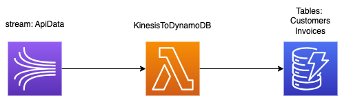

# AWS E-commerce Streaming

This project aims at simulating the cloud-based infrastructure of an e-commerce company. 

## Goals

Main goal :
- Process transactions made by customers
- Give customers access to their purchase history

Secondary goals :
- Compute average sales
- Other analytics stats

## Content

- [Dataset](#dataset)
- [Pipelines](#pipelines)
  - [Ingestion](#ingestion)
  - [Stream to S3](#stream-to-s3)
  - [Stream to DynamoDB](#stream-to-dynamodb)

## Dataset

The dataset constisting of 8 columns and 541 909 rows, represents transactions made on the e-commerce website.

Attributes : InvoiceNo, StockCode, Description, Quantity, InvoiceDate, UnitPrice, CustomerID, Country.

Source : [E-commerce data](https://www.kaggle.com/datasets/carrie1/ecommerce-data) on Kaggle.

## Pipelines

The platform consists of 3 pipelines, one that sends streaming data, one that stores it in a data lake, : 
Amazon services used but not indicated on the diagrams are IAM and Cloudwatch. 

### Ingestion

We simulate streaming data by sending each line of a CSV with a Python script to the API Gateway.
The Lambda function forwards the POST request to a Kinesis Data Stream.
We can then access sent data with a GET request through Postman.

### Stream to S3

After data has been put into Kinesis, a Lambda function pulls data directly from Kinesis and saves them as files in S3.

### Stream to DynamoDB

A Lambda function saves the streamed data in a NoSQL database / document store, DynamoDB.

